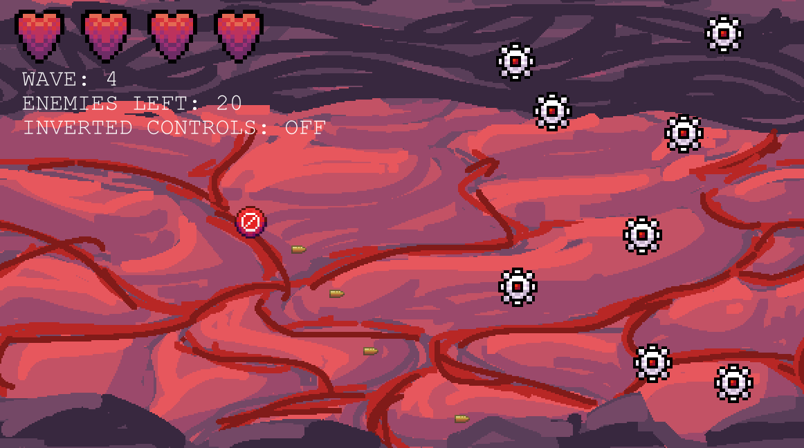

# Choose to Lose
*A 2D Shooter Game by [idi0cy](https://github.com/idi0cy) and RatseerOfRattesse*

2D survival-shooter game where you play as a regular civilian who's dreams are being invaded by advertisements. Fight off corpo robots with biblical smiting themed weaponry and select debuffs instead of buffs each round.

???+ tip

    PLEASE download the executable and run that. The web version is SO LAGGY it's practically unplayable. I know you're distrustful of random online games and shit, but FOR YOUR OWN SANITY.

Itch.io: [https://ratseerofrattesse.itch.io/choose-to-lose](https://ratseerofrattesse.itch.io/choose-to-lose)

## Asset Sources

- button click sound effect: Click3.wav by EdgardEdition -- https://freesound.org/s/113093/ -- License: Attribution 3.0
- bullet shot sound effect: bullet sound effect.wav by Faunusm -- https://freesound.org/s/403339/ -- License: Creative Commons 0
- big bullet shot sound effect: Layered Gunshot 2.WAV by Xenonn -- https://freesound.org/s/128294/ -- License: Creative Commons 0
- pick buff sound effect: Chime 0011.wav by radian -- https://freesound.org/s/62986/ -- License: Attribution 3.0
- player damage sound effect: Damage.ogg by MortisBlack -- https://freesound.org/s/385046/ -- License: Attribution 4.0
- boss damage sound effect: Sci Fi Gun Fires 1.wav by Terry93D -- https://freesound.org/s/327961/ -- License: Creative Commons 0
- boss death sounds:
  - space ship slow down.wav by pointparkcinema -- https://freesound.org/s/407234/ -- License: Creative Commons 0
  - EXPLMisc-CU_Explosion_Nicholas Judy_TDC by designerschoice -- https://freesound.org/s/815440/ -- License: Creative Commons 0
- 